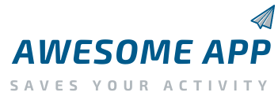

# Introdução

Olá, meu nome é Marvio Rocha, gostaria de compartilhar meus conhecimentos através desse desafio. Primeiramente quero agradecer pela oportunidade de está realizando este desafio com vocês. Sem dúvida desafios sempre nos motivam e ajuda a entender a nossa jornada profissional. Espero que vocês gostem desse  README.md 

## O Projeto



O Projeto Awesome App é voltado para avaliação do desenvolvedor. Esse projeto foi feito com muito carinho e é apenas a primeira versão do desafio.

## Deploy

Utilizei o docker como desenvolvimento. Segue abaixo uma sugestão de test desse ambiente. Para este environment segue abaixo como fazer o deploy:

pré-requisitos:


1. Docker e docker-compose
2. NodeJS 12+
3. Makefile

```sh
git clone https://github.com/marviorocha/desafios-desevolvimento.git
```
```sh
cd desafios-desevolvimento/
```
```sh
make server
```

**Atalhos e comando make para auxiliar**

- make server 
- make up
- make down
- make bash

Para mais comandos, por favor veja o arquivo [Makefile](./Makefile)


### Backend
- Ruby versão: 3.0.1
- Rails versão: 6.1
- Postgres
- Svelte
- Node JS
### Frontend
- TailwindCSS
- HTML5
### Test
- Capybara e rspec
